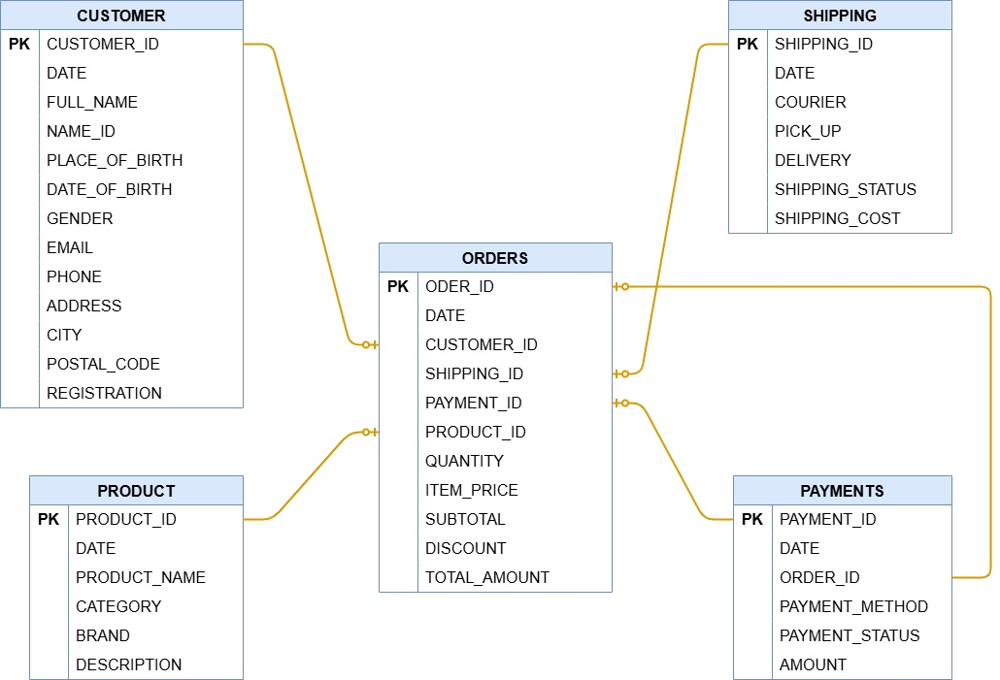
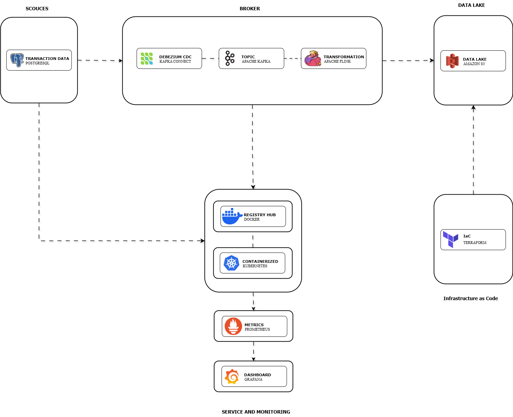

## Real-Time Order & Transaction Analytics (E-Commerce)

E-commerce companies need a system that can:

- Collect order transactions in real time
- View order updates as they occur (NEW → PAID → SHIPPED → COMPLETED)
- Quickly calculate GMV (Gross Merchandise Value)
- Monitor sales activity by product, category, city, and hour
- Provide high-quality data for batch analysis
- Generate daily, weekly, and monthly reports
- That's why companies need a Real-Time + Batch Data Pipeline like the one you built.

## Project Objectives

This pipeline was built to:

Real-time objectives

- Capture order changes in PostgreSQL using Debezium CDC
- Send streaming events to Kafka
- Process events (streaming ETL) with Flink with low latency
- Save real-time snapshots to the Data Lake in S3 AWS or Cloud Storage GCP

Batch objectives

- Cleanse and process data to Bronze, Silver & Gold layers → Airflow
- Process data ingestion to Bronze layer → Spark
- Process data modeling to Silver layer & Gold Layer → DBT
- Input structured data into Redshift or BigQuery
- Produce dashboards for business/marketing teams

# ERD (Entity Relationship Diagram)

  

# Data Architecture

  

# Technologies

| Technologies                        | Tools                                                               |
|-------------------------------------|---------------------------------------------------------------------|
| **Cloud**                           | Google Cloud Platform (GCP) & Amazon Web Services (AWS)             |
| **Infrastructure as Code (IaC)**    | Terraform                                                           |
| **Container**                       | Docker & Kubernetes                                                 |
| **Workflow orchestration**          | Apache Airflow                                                      |
| **RDBMS**                           | PostgreSQL                                                          |
| **Data Modeling**                   | DBT                                                                 |
| **Data Warehouse**                  | BigQuery & Redshift                                                 |
| **CDC**                             | Debezium                                                            |
| **Stream processing**               | Apache Kafka & Apache Flink                                         |
| **Batch processing**                | Apache Spark                                                        |
| **Programming**                     | Python and SQL                                                      |
| **Metric**                          | Prometheus                                                          |
| **Dashboard**                       | Grafana                                                             |

# Run Project

1. **Clone This Repo** 
2. **Open Docker Desktop**
3. **Run Kubernetes**
- `minikube`
4. **Run Kubernetes to env**
- `eval $(minikube docker-env)`
5. **Run dockerfile postgres** :
- `make postgres`
6. **Run dockerfile for batch processing** :
- `make docker-build-batching`
7. **Run dockerfile for stream processing** :
- `make docker-build-streaming`
8. **Run dockerfile for Monitoring** :
- `make docker-build-monitoring`
9. **Run for create a dataset on Cloud Storage & BigQuery** :
- Create a folder and name it credentials, then download the service account file on GCP and put it in the credentials folder then use it as the variable "credentials" for the variables.tf file in the terraform folder.
- `cd terraform`
- `terraform init`
- `terraform apply`
* if you want to delete the dataset, run this `terraform destroy`
10. **Run for create a dataset on S3 & Redshift** :
- `cd terraform`
- `terraform init`
- `terraform apply`
* if you want to delete the dataset, run this `terraform destroy`

**Procedure**
11. **Run for step database to active and inactive**
- `make kubectl-Starting-batching-k8s`
- `make kubectl-Stopping-batching-k8s`

12. **Run for step streaming to active and inactive**
- `make kubectl-Starting-streaming-k8s`
- `make kubectl-Stopping-streaming-k8s`

13. **Run for step Batching to active and inactive**
- `make kubectl-Starting-batching-k8s`
- `make kubectl-Stopping-batching-k8s`

14. **Run for step Monitoring to active and inactive**
- `make kubectl-Starting-monitoring-k8s`
- `make kubectl-Stopping-monitoring-k8s`

**UI**
15. **Run for UI database**
- `make kubectl-running-database-k8s`

16. **Run for UI streaming**
- `make kubectl-running-streaming-k8s`

17. **Run for UI Batching**
- `make kubectl-running-batching-k8s`

18. **Run for UI Monitoring**
- `make kubectl-running-monitoring-k8s`

| Command        | Description                                                                              |
|----------------|------------------------------------------------------------------------------------------|
| `docker-build` | Build Docker Images (amd64) including its inter-container network.                       |
| `debezium`     | Capture database changes in real-time.                                                   |
| `spark`        | Run a Spark cluster, rebuild the postgres container, then create the destination tables. |
| `kafka`        | Spin up a Kafka cluster.                                                                 |
| `flink`        | Run a Flink cluster, create transfrom and ingestion tables.                              |
| `airflow`      | Build the orchestrator.                                                                  |
| `dbt`          | Create the dimension and fact tables.                                                    |
| `postgres`     | Run the database of relationships.                                                       |
| `terraform`    | Automate several services that are needed, such as BigQuery.                             |
| `prometheus`   | Metrics real-time data.                                                                  |
| `grafana`      | Monitor real-time data.                                                                  |

**additional**

-development    = kubectl get deployment
-pods           = kubectl get pods
-service        = kubectl get svc
-ingress        = kubectl get ingress
-configmap      = kubectl get configmap
-secret         = kubectl get secret
-pv and pvc     = kubectl get pv and kubectl get pvc
-all resouces   = kubectl get all

**delete** 
kubectl delete all --all
kubectl delete pvc --all
kubectl delete pv --all
kubectl delete configmap --all
kubectl delete secret --all

# Documentation