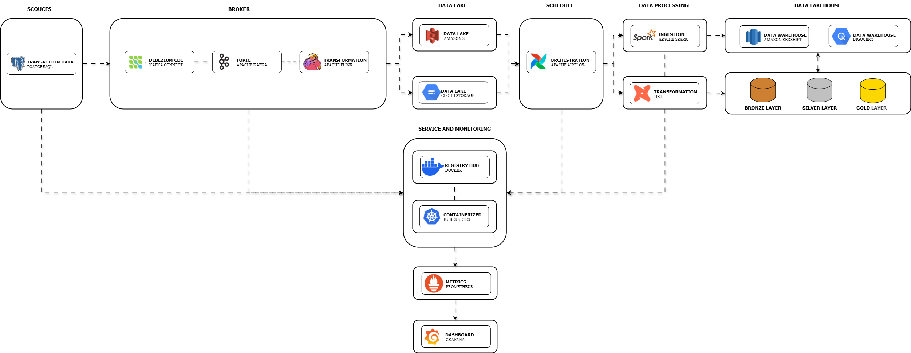
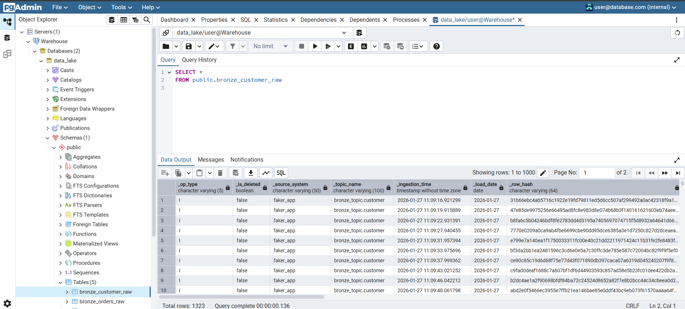
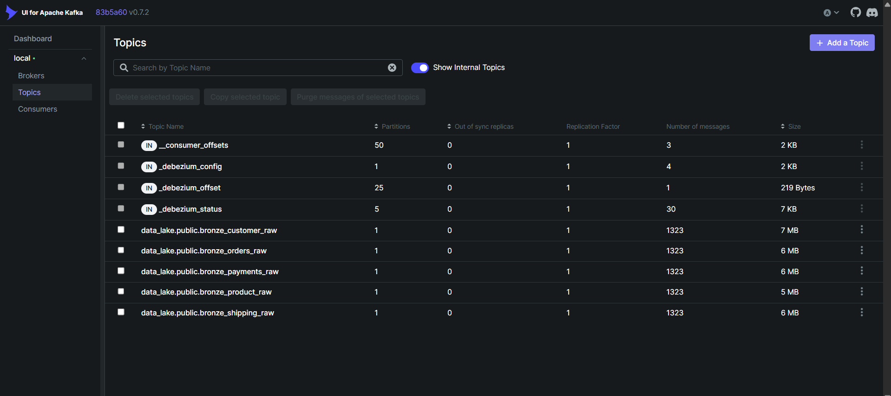

## Real Time Order Transactions Analytic E-Commerce

## Overview

This project implements a real-time streaming data pipeline for e-commerce order transactions. The pipeline is designed to capture order changes as they occur, process them with low latency, and store the results in a scalable Amazon S3 data lake for further analytics.
The system focuses on streaming ingestion and processing only. Batch analytics, BI dashboards, and data warehouse integration are intentionally kept out of scope to clearly demonstrate real-time data engineering capabilities.

## Business Problem

E-commerce platforms generate high-volume transactional data with frequent state changes. The business needs a system that can:

- Capture order transactions in real time
- Track order lifecycle changes (NEW → PAID → SHIPPED → COMPLETED)
- Calculate Gross Merchandise Value (GMV) with low latency
- Monitor sales activity by product, category, city, and time window
- Store high-quality streaming data for future batch and analytical use

## Project Objectives

This pipeline was built to:

- Capture row-level changes from PostgreSQL using Debezium CDC
- Stream transactional events through Apache Kafka
- Perform stateful streaming ETL using Apache Flink
- Handle real-time aggregations and order state transitions
- Persist near real-time processed data into Amazon S3 as a data lake
- Deploy services using Docker & Kubernetes
- Monitor system health and metrics with Prometheus & Grafana

## Architecture

Data Flow:

`PostgreSQL → Debezium CDC → Kafka → Flink (Streaming ETL) → Amazon S3`

Infrastructure & Operations:

- Containerized services managed with Kubernetes
- Docker Hub used as container registry
- Infrastructure provisioned using Terraform (IaC)
- Metrics collected by Prometheus and visualized in Grafana

# ERD (Entity Relationship Diagram)

<div style="text-align: center;">
  
</div>

# Data Architecture

<div style="text-align: center;">
  
</div>

# Technologies

| Technologies                        | Tools                                                               |
|-------------------------------------|---------------------------------------------------------------------|
| **Cloud**                           | Amazon Web Services (AWS)                                           |
| **Infrastructure as Code (IaC)**    | Terraform                                                           |
| **Container**                       | Docker & Kubernetes                                                 |
| **RDBMS**                           | PostgreSQL                                                          |
| **CDC**                             | Debezium                                                            |
| **Stream processing**               | Apache Kafka & Apache Flink                                         |
| **Programming**                     | Python and SQL                                                      |
| **Metric**                          | Prometheus                                                          |
| **Dashboard**                       | Grafana                                                             |

# Run Project

1. **Clone This Repo** 
2. **Open Docker Desktop**
3. **Run for create a dataset on S3** :
- `cd terraform`
- `terraform init`
- `terraform apply`
* if you want to delete the dataset, run this `terraform destroy`

**Procedure**

1. **Run for step database to active and inactive**

**start:**

- `make kubectl-database-k8s`

**Run Create DB in Postgres**

`make DDL`

**Run Insert Data to DB Postgres**

`make DML`

**stop/delete:**

- `make kubectl-Stopping-database-k8s`


2. **Run for step streaming to active and inactive**

**First Run Kafka and Flink:**

`make kubectl-streaming-k8s`

**Second Run Debezium:**

`make kubectl-running-streaming-debezium-k8s`

**Checking Status Debezium**

`curl http://localhost:8083/connectors/data_lake-cdc-connector/status`

**stop/delete:**

`make kubectl-Stop-Streaming-k8s`

**Streaming Process:**

`make kubectl get pods` #check pods in running

**Copy flink:**

`kubectl cp flink-scripts/flink_consumer.py flink-jobmanager-xxxxxxxxxx:/opt/flink/flink-scripts/flink_consumer.py`

**Enter to Bash Flink:**

`kubectl exec -it flink-jobmanager-xxxxxxxxxx -- bash`

**Run Flink normal (real-time):**

`flink run -py /opt/flink/flink-scripts/flink_consumer.py -p 1`

**Run Flink Backfill (BACKFILL_FROM_DATE = date):**

`FLINK_MODE=backfill BACKFILL_FROM_DATE=2026-xx-xx flink run -py /opt/flink/flink-scripts/flink_consumer.py -p 1`


3. **Run for step Monitoring to active and inactive**

**start:**

- `make kubectl-Starting-monitoring-k8s`

**stop/delete:**

- `make kubectl-Stopping-monitoring-k8s`


| Command        | Description                                                                              |
|----------------|------------------------------------------------------------------------------------------|
| `docker-build` | Build Docker Images (amd64) including its inter-container network.                       |
| `debezium`     | Capture database changes in real-time.                                                   |
| `kafka`        | Spin up a Kafka cluster.                                                                 |
| `flink`        | Run a Flink cluster, create transfrom and ingestion tables.                              |
| `postgres`     | Run the database of relationships.                                                       |
| `terraform`    | Automate several services that are needed, such as BigQuery.                             |
| `prometheus`   | Metrics real-time data.                                                                  |
| `grafana`      | Monitor real-time data.                                                                  |

## Please Add at .env

```
AWS_ACCESS_KEY_ID=Your-AWS_ACCESS_KEY_ID
AWS_SECRET_ACCESS_KEY=Your-AWS_SECRET_ACCESS_KEY
AWS_DEFAULT_REGION=ap-southeast-1
```

*copy and paste to file .env

## Please Add for Bucket S3 at k8s/streaming/config/config-flink.yaml

```
fs.s3a.impl: org.apache.hadoop.fs.s3a.S3AFileSystem
fs.s3a.path.style.access: true
fs.s3a.connection.ssl.enabled: true
state.checkpoints.dir: s3a://Your-buckets/flink/checkpoints
state.savepoints.dir: s3a://Your-buckets/flink/savepoints
fs.s3a.endpoint: s3.amazonaws.com
fs.s3a.access.key: Your-Access-Key
fs.s3a.secret.key: Your-secret-Key
fs.s3a.path.style.access: true
```

*copy and paste to file config-flink.yaml at flink-conf.yaml

**additional**

- development    = kubectl get deployment
- pods           = kubectl get pods
- service        = kubectl get svc
- ingress        = kubectl get ingress
- configmap      = kubectl get configmap
- secret         = kubectl get secret
- pv and pvc     = kubectl get pv and kubectl get pvc
- all resouces   = kubectl get all

**delete** 

- kubectl delete all --all
- kubectl delete pvc --all
- kubectl delete pv --all
- kubectl delete configmap --all
- kubectl delete secret --all

## Documentation

Postgresql With PgAdmin UI :

`http://localhost:30080/`

<div style="text-align: center;">
  
</div>

Kafka With provectuslabs UI :

`http://localhost:30087/ui/clusters/local/all-topics`

<div style="text-align: center;">
  
</div>

Flink UI:

`http://localhost:30081/`

<div style="text-align: center;">
  
</div>

Prometheus & Grafana:

- Prometheus

`http://localhost:32222/`

<div style="text-align: center;">
  
</div>

- Grafana

`http://localhost:32000/`

<div style="text-align: center;">
  
</div>